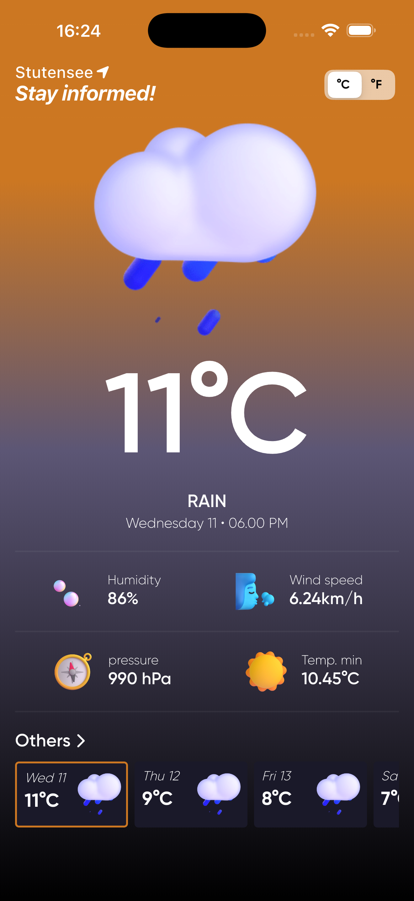
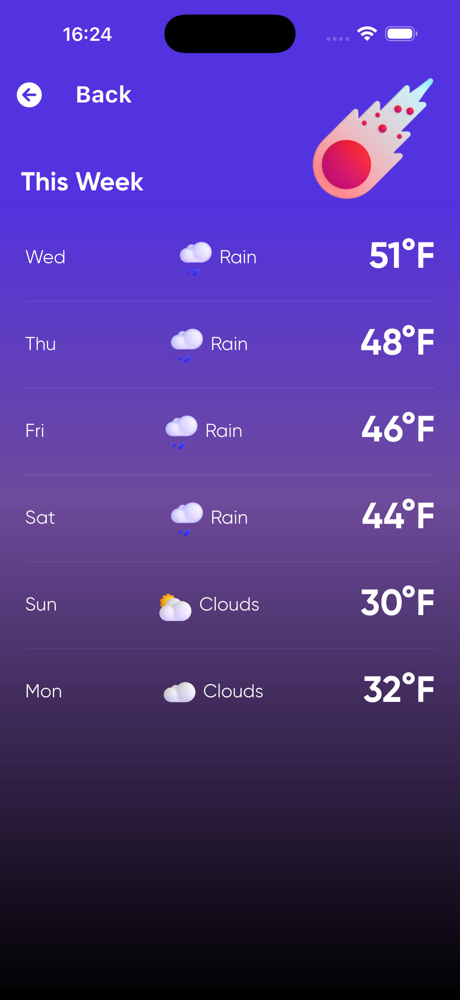

# Weather App

A Flutter weather application that fetches forecast data from OpenWeather and presents it in a modern, card-driven UI.

The app is currently configured for a fixed location (Stutensee) and shows day-level forecast summaries with a details screen for the week.

## 📸 App Screenshots

<p float="left">
  
  
  
</p>


## Features

- ✅ 5-day forecast display with one representative entry per day
- ✅ Main weather dashboard showing temperature, condition, and formatted date/time
- ✅ Weather detail tiles for humidity, wind speed, pressure, and minimum temperature
- ✅ Weekly weather screen with a compact day-by-day list
- ✅ Temperature unit toggle (`C` / `F`) using segmented control
- ✅ Pull-to-refresh on both main and weekly screens
- ✅ Dedicated loading and error states, including retry action
- ✅ Condition-based weather icon mapping from OpenWeather weather codes
- ✅ Network connectivity check before performing API requests

## Architecture

The project follows a layered, Clean Architecture-inspired structure:

- `presentation`: UI, state management (`Cubit`), widgets, and screens
- `domain`: business entities, repository contracts, and use cases
- `data`: API data source, models, and repository implementation
- `core`: shared concerns (errors, DI, theme, constants, network utility, routing)

### State Management

- Uses `flutter_bloc` with a single `WeatherCubit`
- `WeatherCubit` emits `WeatherInitialState`, `WeatherLoadingState`, `WeatherLoadedState`, and `WeatherErrorState`

### Dependency Injection

- Uses `get_it` service locator in `core/services/locator_service.dart`
- Registers cubit, use case, repository, remote data source, network info, and HTTP client

### Data Flow

1. UI calls `WeatherCubit.fetchWeather()`
2. Cubit executes `GetWeatherUseCase`
3. Use case calls `WeatherRepository.getWeather()`
4. Repository checks connectivity via `NetworkInfo`
5. Repository fetches from `WeatherRemoteDataSource` if online
6. API response maps into `WeatherModel` objects (domain `Weather` entities)
7. Cubit filters duplicates by day and emits loaded/error state

## Architecture Decisions

- Layered boundaries (`presentation/domain/data`) to keep UI concerns separate from networking and domain logic.
- Repository pattern to isolate data access and enable easier replacement of data sources later.
- Use case abstraction (`GetWeatherUseCase`) to keep business actions explicit and testable.
- `Cubit` chosen for simple unidirectional state updates with low boilerplate.
- `Either<Failure, T>` (from `dartz`) used across the domain boundary to model success/failure explicitly.
- Centralized DI with `get_it` to avoid tight coupling between constructors across layers.
- Route generation centralized in `AppRouter` for a single navigation entry point.

## Project Structure

```text
lib/
  core/
    constants/
    errors/
    helpers/
    network/
    router/
    services/
    theme/
  data/
    data_sources/remote/
    models/
    repositories/
  domain/
    entities/
    repositories/
    usecases/
  presentation/
    states/cubits/
    views/
    widgets/
  main.dart
```

## API and Configuration

- Weather data source: OpenWeather 5-day forecast endpoint (`/data/2.5/forecast`)
- Units are controlled by `WeatherParams.units` (`metric` or `imperial`)
- The current implementation uses hard-coded API key, latitude, and longitude values

## Getting Started

### Prerequisites

- Flutter SDK (`>=3.2.3 <4.0.0`)
- Dart SDK compatible with the Flutter version


## Current Limitations

- Location is fixed in code (no city search or geolocation yet)
- API key is stored in source code
- Existing widget test is still template boilerplate and does not reflect current UI behavior

## Suggested Next Improvements

- Add location search/geolocation support
- Externalize API key and runtime settings
- Add local cache/offline fallback
